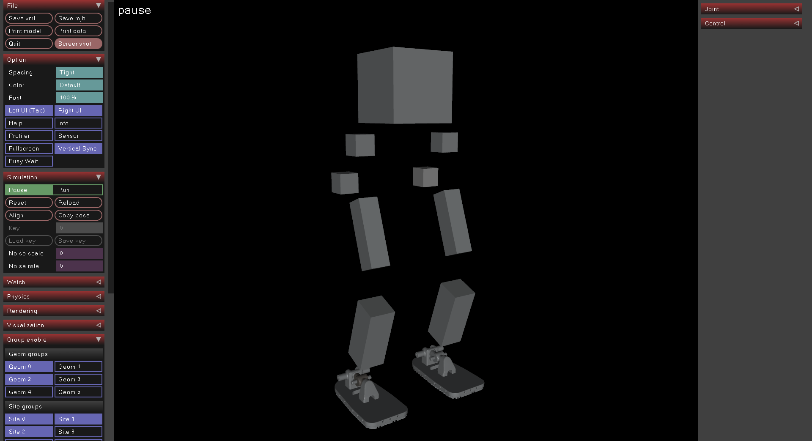
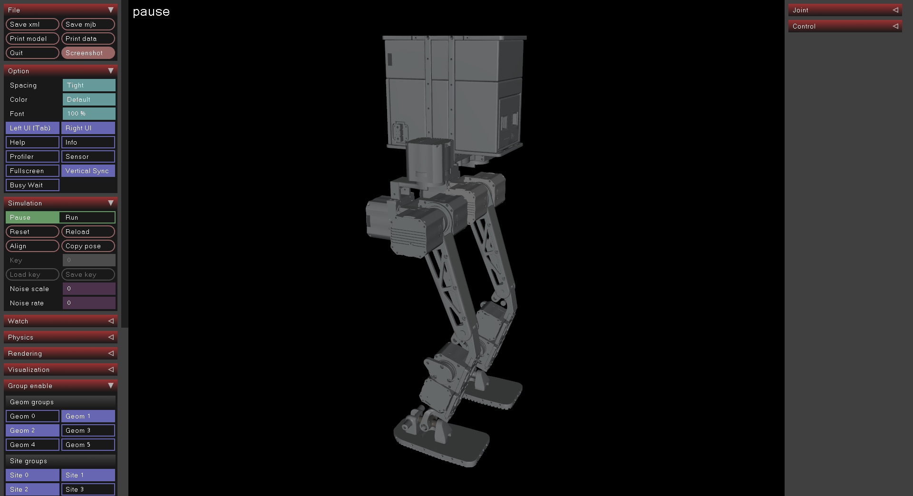

sim2real config：

```yaml
urdf_dof_pos_offset: [0,0,-0.35,0.7,-0.35,0,
	    	     0,0,-0.35,0.7,-0.35,0]
joint_controller_names: [
    "l_hip_yaw_joint",
    "l_hip_roll_joint",
    "l_thigh_joint",
    "l_calf_joint",
    "l_ankle_pitch_joint",
    "l_ankle_roll_joint",
    "r_hip_yaw_joint",
    "r_hip_roll_joint",
    "r_thigh_joint",
    "r_calf_joint",
    "r_ankle_pitch_joint",
    "r_ankle_roll_joint"]
```

rl_config：

```python
foot_name = "ankle_roll"
knee_name = "calf"
default_joint_angles = {  # = target angles [rad] when action = 0.0
  'r_hip_yaw_joint': 0.0,
  'r_hip_roll_joint': 0.0,
  'r_thigh_joint': 0.0,
  'r_calf_joint': 0.0,
  'r_ankle_pitch_joint': 0.0,
  'r_ankle_roll_joint': 0.0,
  'l_hip_yaw_joint': 0.0,
  'l_hip_roll_joint': 0.0,
  'l_thigh_joint': 0.0,
  'l_calf_joint': 0.0,
  'l_ankle_pitch_joint': 0.0,
  'l_ankle_roll_joint': 0.0,
}
stiffness = {'hip_yaw_joint': 80.0, 'hip_roll_joint': 80.0, 'thigh_joint': 80.0,
             'calf_joint': 80.0, 'ankle_pitch_joint': 80, 'ankle_roll_joint': 80,}
damping = {'hip_yaw_joint': 0.25, 'hip_roll_joint': 0.25, 'thigh_joint': 0.25, 
	   'calf_joint': 0.25, 'ankle_pitch_joint': 0.25, 'ankle_roll_joint': 0.25
```




